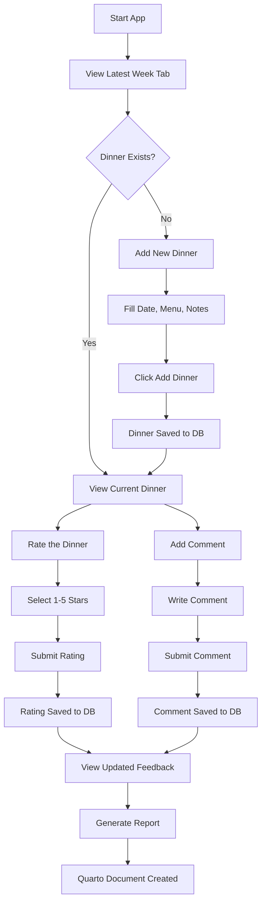
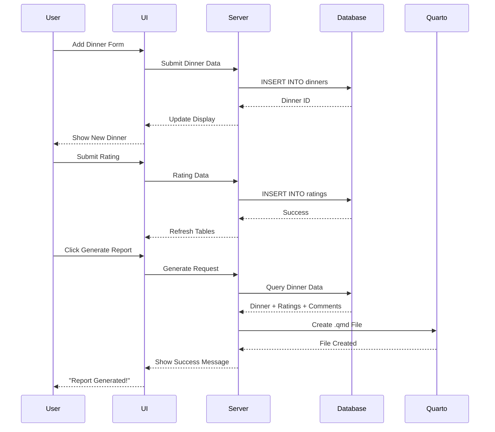
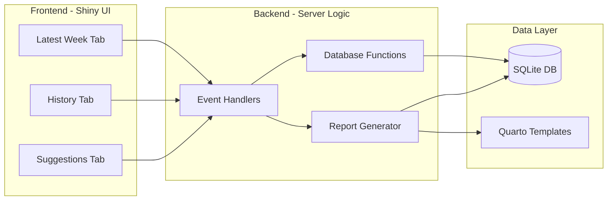

# Application Workflow

## User Journey: Adding and Rating a Dinner



## Data Flow: From Input to Report



## Application Architecture



## Component Interactions

### 1. Adding a Dinner

```
User Input
    ↓
Date Picker (dateInput) 
Menu Text Area (textAreaInput)
Notes Text Area (textAreaInput)
    ↓
Action Button (actionButton)
    ↓
observeEvent Handler
    ↓
Validation (req)
    ↓
add_dinner() Function
    ↓
SQLite INSERT
    ↓
trigger() Update
    ↓
UI Refresh
```

### 2. Rating a Dinner

```
User Input
    ↓
Name Field (textInput)
Star Slider (sliderInput: 1-5)
    ↓
Submit Button
    ↓
observeEvent Handler
    ↓
get_latest_dinner()
    ↓
add_rating(dinner_id, name, rating)
    ↓
SQLite INSERT
    ↓
trigger() Update
    ↓
Ratings Table Refresh (renderDT)
```

### 3. Generating Report

```
Generate Button Click
    ↓
get_latest_dinner()
    ↓
get_ratings(dinner_id)
get_comments(dinner_id)
    ↓
Calculate Statistics
(Average Rating, Counts)
    ↓
Read Template File
(weekly_dinner_template.qmd)
    ↓
Replace Placeholders
{{DATE}}, {{MENU}}, etc.
    ↓
Write New .qmd File
(weekly_dinner_YYYY_MM_DD.qmd)
    ↓
Notification to User
```

## State Management

The application uses reactive programming:

- **trigger**: A `reactiveVal()` counter that forces UI updates
- When data changes (add, update, delete), `trigger()` is incremented
- All `output$` rendering functions depend on `trigger()`
- This ensures fresh data from the database on every change

```r
# Initialize
trigger <- reactiveVal(0)

# On data change
trigger(trigger() + 1)

# In output functions
output$table <- renderDT({
    trigger()  # Creates dependency
    get_data() # Fetches fresh data
})
```

## Database Relationships

```
dinners (1) ──< (many) ratings
   ↓
  id ────────────> dinner_id
   
dinners (1) ──< (many) comments
   ↓
  id ────────────> dinner_id

suggestions (independent table)
```

## File Structure and Responsibilities

```
app.R
├── Library Imports
├── Database Functions
│   ├── init_db()
│   ├── get_* functions (read)
│   └── add_* functions (write)
├── UI Definition
│   ├── Latest Week Tab
│   ├── History Tab
│   └── Suggestions Tab
└── Server Logic
    ├── Reactive Values
    ├── Output Renderers
    └── Event Observers
```

## Quarto Template System

Template placeholders are replaced at runtime:

| Placeholder | Source | Processing |
|-------------|--------|------------|
| `{{DATE}}` | `dinner$date` | Direct replacement |
| `{{MENU}}` | `dinner$menu` | Direct replacement |
| `{{NOTES}}` | `dinner$notes` | With fallback |
| `{{AVG_RATING}}` | `mean(ratings$rating)` | Calculated |
| `{{NUM_RATINGS}}` | `nrow(ratings)` | Counted |
| `{{NUM_COMMENTS}}` | `nrow(comments)` | Counted |

Process:
1. Read template line by line
2. Use `gsub()` to replace each placeholder
3. Write modified content to new file
4. Filename includes date for organization

## Extension Points

### Adding New Features

1. **New Data Field**
   - Add column to database table
   - Add input widget to UI
   - Update add_* function
   - Update output displays

2. **New Interaction Type**
   - Create new table in database
   - Add tab or panel to UI
   - Create get_* and add_* functions
   - Add event observer
   - Update trigger system

3. **Enhanced Reports**
   - Modify template .qmd file
   - Add new placeholders
   - Update generation logic
   - Add data queries as needed

4. **Authentication**
   - Add user table to database
   - Integrate shiny.auth or similar
   - Modify event handlers to track user
   - Update UI to show/hide based on role

## Performance Considerations

- **Database**: SQLite is lightweight, sufficient for < 1000 weekly dinners
- **Reactivity**: Manual trigger control prevents unnecessary re-renders
- **Tables**: DT provides client-side pagination for large datasets
- **File I/O**: Quarto generation is on-demand, not automatic

## Deployment Options

### Local Usage (Current)
- Run from RStudio
- Access at `http://localhost:####`
- Data stored locally in .db file

### Shiny Server
1. Install Shiny Server
2. Copy app files to `/srv/shiny-server/`
3. Access via web browser
4. Consider shared database location

### shinyapps.io
1. Create account at shinyapps.io
2. Use `rsconnect` package
3. Deploy: `rsconnect::deployApp()`
4. Cloud-hosted, accessible anywhere

### Docker Container
1. Create Dockerfile with R + packages
2. Copy app files
3. Expose port
4. Deploy to cloud or local server
